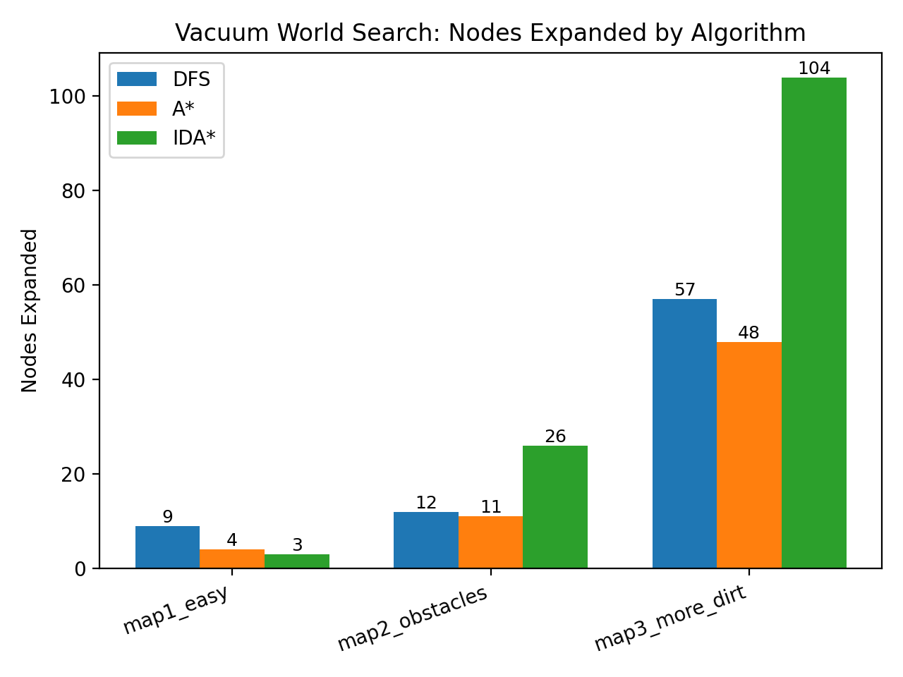
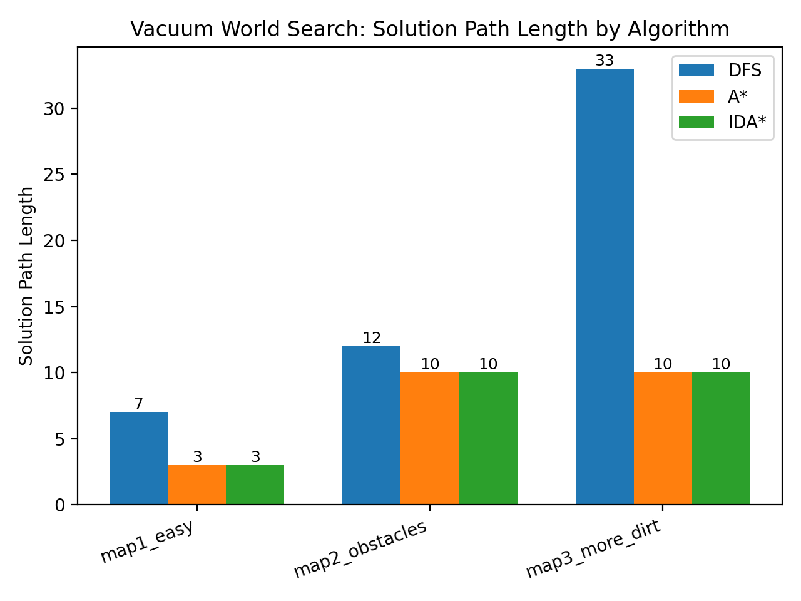
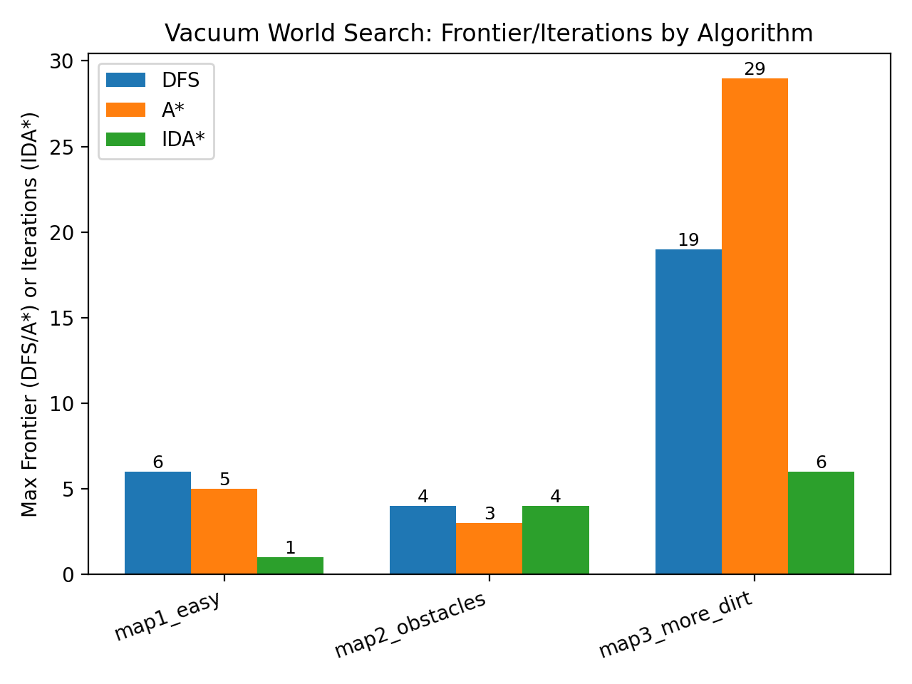
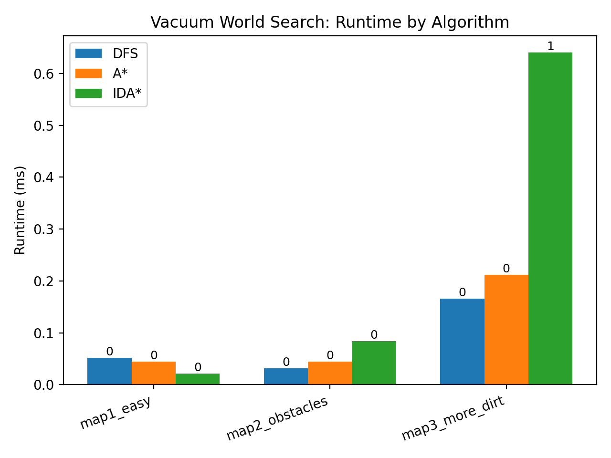

# Homework 1 - Vacuum World Search (DFS vs A* vs IDA*)

This project implements and evaluates three classical search algorithms-**Depth-First Search (DFS)**, **A\***, and **Iterative Deepening A\* (IDA\*)**-on an extended **Vacuum World** grid environment. The implementation is designed to be reproducible, metrics-driven, and easy to run locally.

---

## 1. Problem Setup (Vacuum World)

### Environment
- The world is a **2D grid** with:
  - **Start position** `S`
  - **Dirty cells** `D`
  - **Obstacles** `#`
  - Empty cells `.`

### State Representation
A state is defined as:
- `robot_position = (row, col)`
- `dirty_cells = set of remaining dirty positions`

So the state is:  
**(robot_position, dirty_cells_remaining)**

### Actions (All cost = 1)
- **UP, DOWN, LEFT, RIGHT**: Move the agent (only if valid and not into obstacles)
- **CLEAN**: Removes dirt if the current cell is dirty

### Goal
A state is a goal if:  
 **All dirt has been cleaned** (`dirty_cells_remaining` is empty)

---

## 2. Algorithms Implemented

### DFS (Depth-First Search)
- Iterative stack-based DFS
- Uses an explored set to avoid cycles
- Returns the *first found* solution (not guaranteed optimal)

**Metrics recorded**
- Solution path length
- Nodes expanded
- Maximum frontier size

---

### A* Search
- Priority queue ordered by **f(n) = g(n) + h(n)**
- Supports reopening states when a better cost path is found (standard A* behavior)

**Metrics recorded**
- Solution path length (optimal when heuristic is admissible)
- Nodes expanded
- Maximum frontier size

---

### IDA* (Iterative Deepening A*)
- Performs DFS with increasing **f-cost thresholds**
- Uses **linear memory** (no global explored set across iterations)
- May re-expand nodes across iterations

**Metrics recorded**
- Solution path length (optimal when heuristic is admissible)
- Nodes expanded
- Iteration count (number of threshold passes)

---

## 3. Heuristic Used (for A* and IDA*)

This project uses an admissible heuristic:

**Dirty + Nearest Dirty Distance**
- `h(state) = (# dirty remaining) + (Manhattan distance from robot to nearest dirty cell)`

Why it is admissible:
- Each dirty cell requires at least one `CLEAN` action
- Manhattan distance ignores obstacles, so it never overestimates the true shortest path

---

## 4. Project Structure

```
hw1_vacuum/
  vacuum_world.py        # Vacuum World definition (state, actions, transitions)
  heuristics.py          # Heuristic functions
  dfs.py                 # DFS implementation
  astar.py               # A* implementation
  idastar.py             # IDA* implementation
  runner.py              # Runs experiments, collects metrics, exports CSV
  plots.py               # Generates plots from results
  tests.py               # Basic correctness tests
  results.csv            # Experiment output table (generated)
  *.png                  # Generated plots (generated)
```

---

## 5. How to Run (Local Execution)

### Step 1 - Create and activate environment
```bash
python -m venv .venv
# Windows PowerShell:
.venv\Scripts\activate
# Mac/Linux:
source .venv/bin/activate
```

### Step 2 - Install dependencies
```bash
pip install matplotlib
```

### Step 3 - Run tests
```bash
python tests.py
```

Expected output:
```
All tests passed!
```

### Step 4 - Run experiments
```bash
python runner.py
```

This will:
- run DFS, A*, and IDA* on all maps
- print results to console
- generate `results.csv`
- generate plots (`*.png`)

---

## 6. Output Files (Generated)

After running `runner.py`, the following files are created:

###  Results Table
- **`results.csv`**  
Contains: map, algorithm, path length, nodes expanded, frontier/iterations, runtime (ms)

###  Plots
- **`nodes_expanded.png`** - search effort (state expansions)
- **`path_length.png`** - solution quality (optimality)
- **`runtime_ms.png`** - wall-clock runtime (milliseconds)
- **`frontier_or_iters.png`** - DFS/A* max frontier (memory proxy) and IDA* iterations (threshold passes)

---

## 7. Output Visualizations

> If you view this README on GitHub or a markdown viewer in the same folder, the images below will render automatically.

### Nodes Expanded


### Solution Path Length


### Frontier / Iterations


### Runtime (ms)


---

## 8. Experimental Maps Included

The runner evaluates three maps:

- `map1_easy` (small + simple)
- `map2_obstacles` (obstacles constrain movement)
- `map3_more_dirt` (multiple dirt locations)

Maps are defined in `runner.py` using the grid legend:
- `S` start
- `D` dirty
- `#` obstacle
- `.` empty

---

## 9. Key Observations from Results

### Optimality
- **A\*** and **IDA\*** produced **identical solution path lengths** across all maps  
   confirming optimal solutions under an admissible heuristic.
- **DFS** produced longer solutions (non-optimal), especially as map difficulty increased.

### Nodes Expanded
- **A\*** typically expands fewer nodes than DFS due to heuristic guidance.
- **IDA\*** often expands more nodes on harder maps due to repeated threshold iterations.

### Memory vs Computation Tradeoff
- **A\*** uses more memory (larger frontier)
- **IDA\*** uses less memory but recomputes work across iterations

---

## 10. Notes on Metrics

- **Nodes Expanded**: incremented when a state is expanded (successors generated)
- **Max Frontier Size**:
  - DFS: maximum stack size
  - A*: maximum priority queue size
- **IDA\* Iterations**: number of threshold passes until solution is found

---

## 11. Reproducibility

- Action order is fixed to ensure repeatable results:
  `UP, RIGHT, DOWN, LEFT, CLEAN`
- Outputs are saved deterministically after each run.

---

## 12. How to Extend (Optional)

To evaluate more maps:
- Add additional grids to the `maps` dictionary in `runner.py`.
- Re-run:
```bash
python runner.py
```

---

## Author
Sri Sanjana
